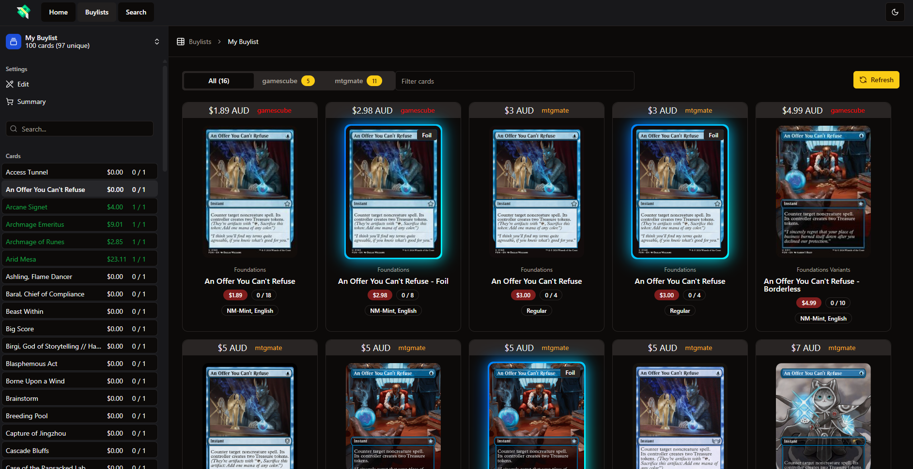

# Scry

A wallet emptying assistant™, down under edition. Some parts WIP

## Usage

1. Download binary for your platform from [releases page](https://github.com/Regalias/scry/releases)
2. Run
3. ???
4. Profit

Notes:
- Left click on the product image to add a copy to your list, right click to remove a copy
- While it eventually works, searching basic lands will take an eternity due to the sheer volume of results
- Expect bugs

### Mac users

https://support.apple.com/en-au/guide/mac-help/mh40616/mac

## Dev

- [wails](https://wails.io/)

To run in live development mode, run `wails dev` in the project directory. This will run a Vite development
server that will provide very fast hot reload of your frontend changes. If you want to develop in a browser
and have access to your Go methods, there is also a dev server that runs on http://localhost:34115. Connect
to this in your browser, and you can call your Go code from devtools.

### Building

To build a redistributable, production mode package, use `wails build`.
